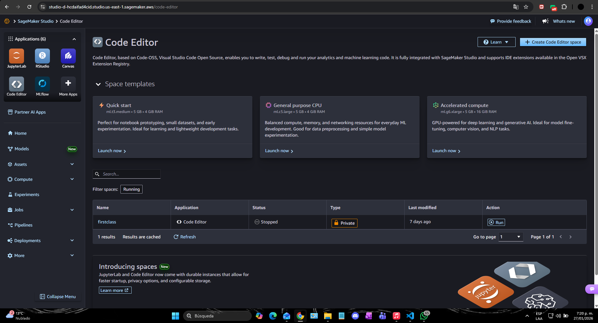
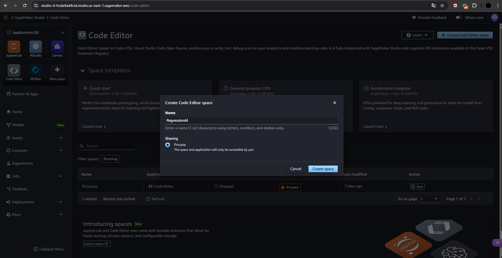
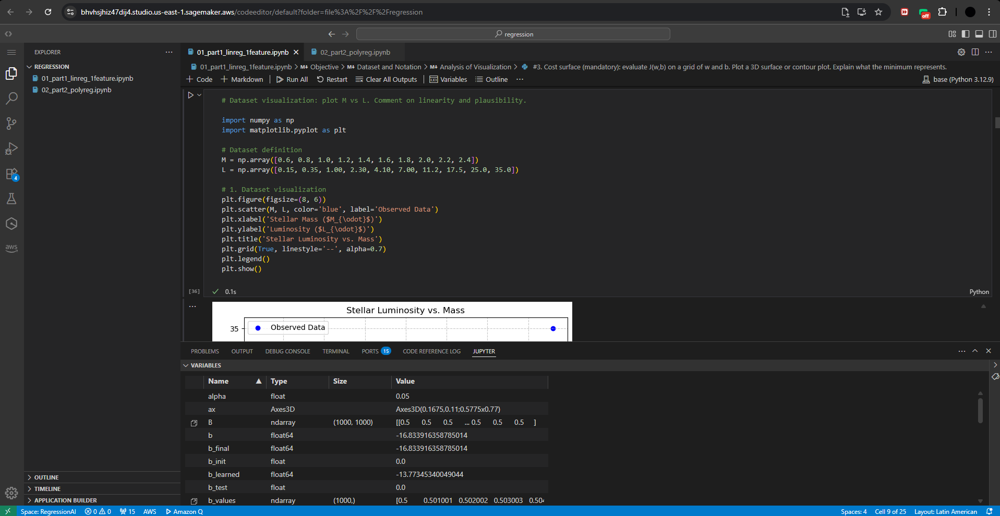
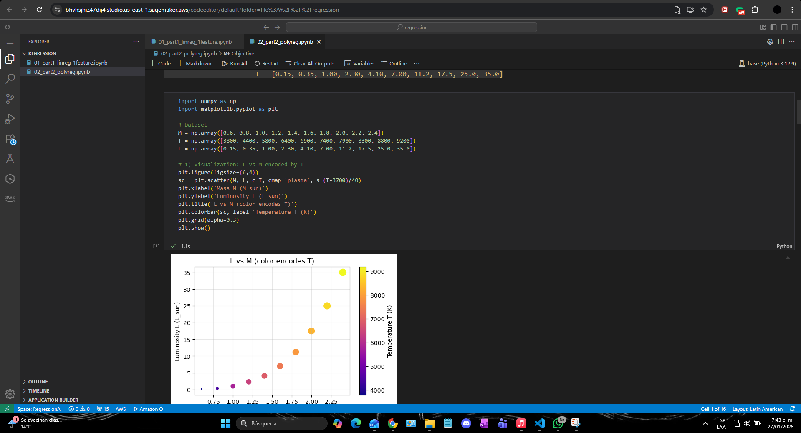
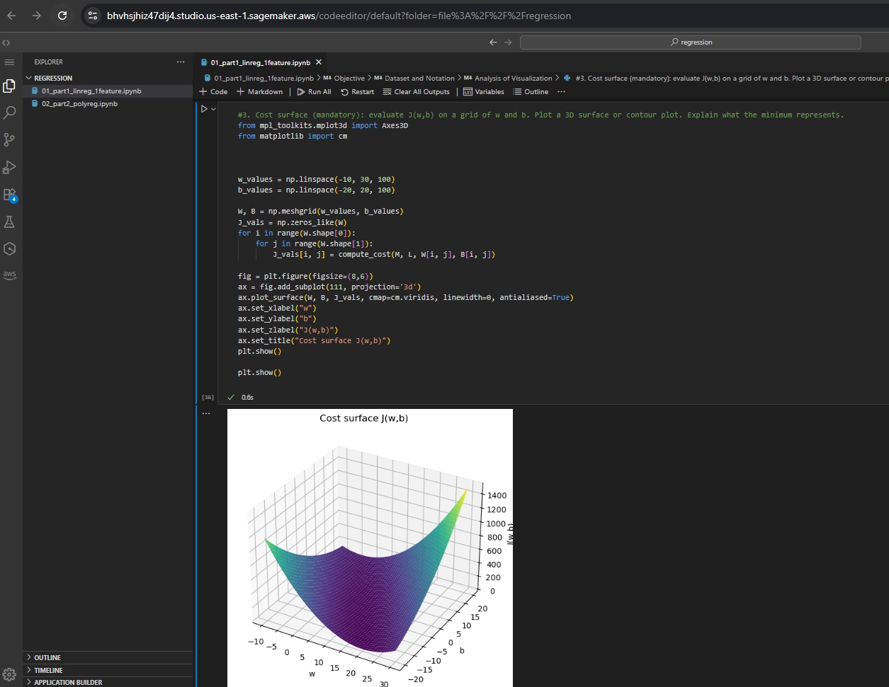

# Regression-and-cloud-ready-AI-Infrastructure

## 1. Introduction and Motivation

This repository demonstrates the implementation of regression techniques from first principles, exploring the relationships between physical quantities through data-driven analysis. Rather than relying on pre-built machine learning libraries, these notebooks explicitly define hypothesis functions, loss functions, and optimization algorithms to provide a foundational understanding of how regression models work.

The notebooks implement both linear regression and polynomial regression, showcasing how increasingly complex models can capture nonlinear relationships in data. This hands-on approach ensures a deep understanding of the mechanics behind these essential machine learning techniques.

## 2. Motivation for Cloud Execution and Enterprise Context

This project is part of a comprehensive Machine Learning Bootcamp embedded within a course on Digital Transformation and Enterprise Architecture. In this context, machine learning is treated as a core architectural capability of modern enterprise systems.

In contemporary enterprises, intelligence is increasingly recognized as a first-class quality attribute alongside scalability, availability, security, and performance. Intelligent behavior is no longer confined to offline analytics; it is embedded into platforms, decision-support services, and autonomous or semi-autonomous components.

As data engineers and architects, it is essential not only to understand what models do, but also to understand how they are built from first principles, executed and validated in controlled environments, and operated within cloud platforms. This project demonstrates these competencies by implementing regression models and deploying them on Amazon SageMaker, a managed machine learning platform that exemplifies enterprise-grade cloud infrastructure.

## 3. Objectives

This repository contains Jupyter notebooks that demonstrate regression techniques and their implementation in a cloud environment using Amazon SageMaker. The notebooks cover various aspects of regression analysis, including linear regression and polynomial regression, and provide insights into how to effectively utilize cloud resources for machine learning tasks.

## 4. Uploading Notebooks to SageMaker

To upload the notebooks to SageMaker, follow these steps:
1. Navigate to the SageMaker console.
2. Create a new notebook instance or use an existing one.
3. Upload the notebooks from your local machine to the instance.

### 4.1 Creating the Code Editor in SageMaker
First, we need to create the code editor or the space in SageMaker.

### 4.2 Successful Execution

### 4.3 Uploading Files
Next, we have to upload our files, in this case, the two notebooks.

### 4.4 Activating the Environment
Once we have uploaded the notebooks, we can activate the environment. In this case, we will use the Python base environment. After activating it, we can run the notebooks.

### 4.5 At Least One Plot Rendered in SageMaker

As we can see, the notebooks were run successfully.

## 5. Comparison of Local Execution vs SageMaker Execution

## 5. Comparison of Local Execution vs SageMaker Execution

In this assignment, the experiments were implemented using Jupyter notebooks, following a first-principles approach to linear and polynomial regression. These notebooks can be executed either locally (on a personal machine) or within a managed cloud environment such as Amazon SageMaker. While the mathematical logic and results of the models remain the same, the execution context introduces important architectural and operational differences.

### 5.1 Local Execution

Local execution refers to running the Jupyter notebooks on a personal computer using a local Python environment.

**Advantages:**
- Full control over the execution environment and dependencies.
- Low latency for small-scale experiments.
- Ideal for learning, prototyping, and debugging algorithms from first principles.
- No cloud costs or external infrastructure required.

**Limitations:**
- Limited computational resources (CPU, memory, no GPUs in many cases).
- Difficult to scale experiments or run multiple training jobs in parallel.
- Results and environments are not easily reproducible across teams.
- Not suitable for enterprise-grade deployment, monitoring, or governance.

From an enterprise architecture perspective, local execution is best viewed as a development and learning environment, rather than a production-ready solution.

### 5.2 SageMaker Execution

Amazon SageMaker provides a fully managed environment for running Jupyter notebooks, training models, and deploying them as scalable services.

**Advantages:**
- On-demand access to scalable compute resources (CPU, GPU, memory).
- Reproducible environments through managed notebooks and containerized execution.
- Native integration with other AWS services (S3, IAM, CloudWatch).
- Support for experiment tracking, versioning, and monitoring.
- Alignment with enterprise requirements such as security, access control, and auditability.

**Limitations:**
- Higher complexity compared to local execution.
- Requires cloud configuration and cost management.
- Slight overhead for simple, small-scale experiments.

In an enterprise context, SageMaker represents an operational ML platform, where models transition from experimental artifacts to governed, scalable, and maintainable components of a larger system.

### 5.3 Architectural Perspective

From a Digital Transformation and Enterprise Architecture viewpoint, the difference between local execution and SageMaker execution reflects a broader shift:
- Local execution emphasizes understanding, correctness, and individual experimentation.
- Cloud execution emphasizes scalability, reliability, governance, and integration into enterprise systems.

## 6. Conclusion

This project demonstrates the implementation of regression techniques from first principles and their execution in a cloud environment using Amazon SageMaker. By comparing local and cloud-based execution, we showcase the architectural benefits of managed machine learning platforms and their role in enterprise digital transformation strategies.

